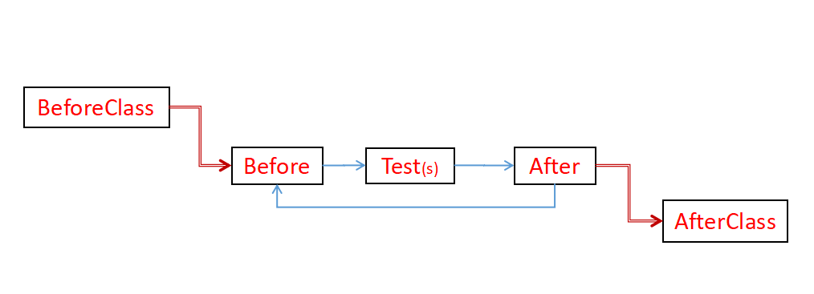
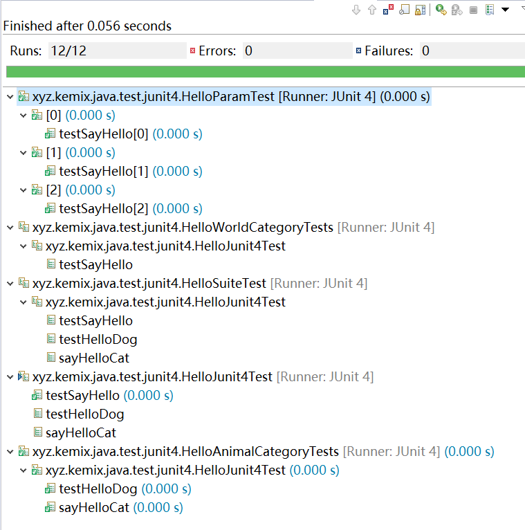

# JUnit 4

Started at 2005, support JDK5 for Annotations.

The version of jar is fixed in 4.12, and the latest update is at Feb, 2014.

Maven: `junit:junit:4.12`

https://junit.org/junit4/

## Life Cycle

## Run test

Right click on project with menu "Run As -> JUnit Test"

NOTE: Because test on project, the results are mixed. 