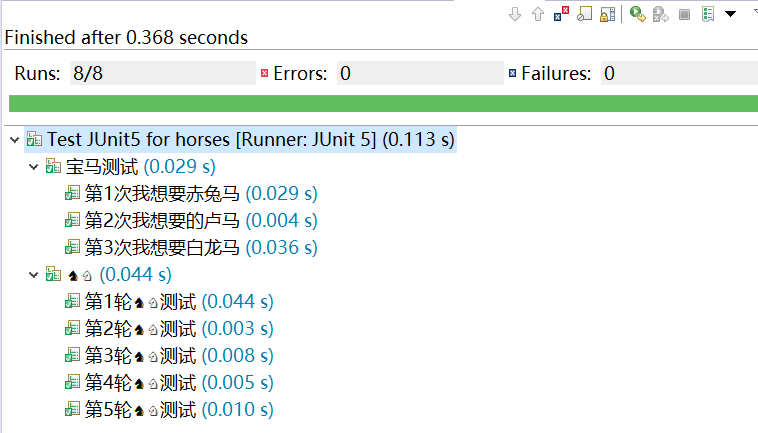

# JUnit 5

Started at 2016, support JDK8 for Lambda.

IDE support:
- IDEA 2017.3
- Eclipse Oxygen.1a (4.7)

https://junit.org/junit5/

## 3 Parts

JUnit 5 = JUnit Platform + JUnit Jupiter + JUnit Vintage

## Annotations vs JUnit4

JUnit 4 | JUnit 5
------------ | -------------
@BeforeClass / @AfterClass | @BeforeAll / @AfterAll 
@Before / @After  |  @BeforeEach / @AfterEach
@Ignore | @Disabled
@Category |  @Tag
<None>  | @Nested
@Test(expected = XXX.class) | assertThrows / expectThrows
@Test(timeout = 1000)  | assertTimeout
org.junit.Assert  |  org.junit.jupiter.api.Assertions
org.junit.Assume  |  org.junit.jupiter.api.Assumptions
<None>  |  assert with Lambda for JDK8
<None>  |   @EnabledXXX/@DisabledXXX

## Life Cycle

Almost same as JUnit4, just some names are different with JUnit4.

## Run test

Right click on project with menu "Run As -> JUnit Test"

